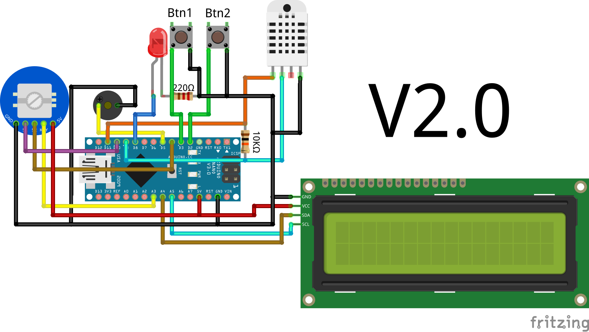
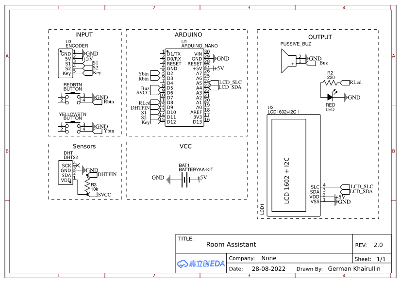

# Room Assistant
## :ru:
### :information_source: Краткая информация
Room Assistant (или, Комнатный помощник) - это один из моих первых pet-проектов. В проекте используется макетная плата микроконтроллера, основанная на микроконтроллере ATmega328P Arduino Nano. Суть проекта: своевременно оповещать пользователя об отдыхе, работе, замерять температуру и влажность в комнате, преобразовывать полученные данные в графики и сохранять в течении 5 дней.

### :alarm_clock: Полезность данного проекта
Самая главная проблема современности здоровья у людей - сидячий образ жизни. И данный проект намерен побороться с этим. Согласно [статье rbc.ru](https://style.rbc.ru/health/5dac0dfa9a79474bc746668c) один из способов решения этой проблемы - переодическая разминка. Мой проект нацелен на помощь пользователю в своевременном оповещении, о том, что пора размяться. А так же о том, что пользователь отдыхает силкшом долго.

### :hammer_and_wrench: Функции
+ Настройку функций и параметров без необходимости перепрошивки
+ Отображение текущей температуры и влажности воздуха в комнате
+ Наличие графиков для ведения статистики за последние 5 дней
+ Поддержка 3 режима работы
+ Сохранение «профилей» устройства с определенными настройками для быстрого доступа
+ Возможность питания от батареек
+ Пользователь, не разбирающийся в программировании, может настроить фундаментальные настройки в коде

### :scroll: Схемы

### :calendar: Статус проекта и будущие идеи
Статус проекта: **В разработке**

Будущие идеи:
+ **Доработка README файла, документации и комментирования**
+ Связь с компьютером через Qt/Processing
+ Получение прогноза погоды от того же компьютера
+ Независимые таймеры
